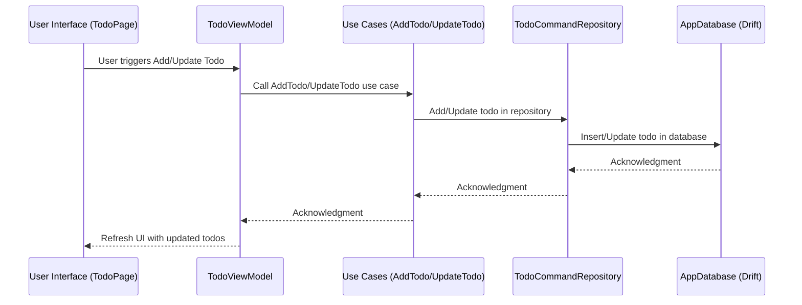

# Flutter Clean Architecture Template

This project is a **Flutter template** that strictly follows **Clean Architecture principles** with a **CQRS (Command Query Responsibility Segregation)** approach.

## System Architecture


## Features

- Domain, Application, Infrastructure, and Presentation layers
- CQRS: Separate Command & Query use cases
- Drift ORM for local persistence
- Dependency Injection via `get_it` and `injectable`
- Fully testable architecture

---

## Folder Structure

```
lib/
├── domain/            # Business rules (Entities, Interfaces)
├── application/       # Use cases (Commands & Queries)
├── infrastructure/    # External systems (Drift, APIs, Repos)
├── presentation/      # UI layer (Pages, ViewModels)
├── core/              # DI, shared utilities
└── main.dart          # Entry point
```

---

## Getting Started

### 1. Install Dependencies
```bash
flutter clean
flutter pub get
```

### 2. Generate DI Code
```bash
flutter pub run build_runner build --delete-conflicting-outputs
```

### 3. Enable the desired platform
```bash
flutter config --enable-web
flutter create .
```

### 4. Check connected devices
```bash
flutter devices
```

### 5. Install Android Studio (if not already installed)
Download and install Android Studio.

### 6. Set up an Android Emulator

### 7. Verify the emulator is available
```
flutter emulators
1 available emulator:

Id                    • Name                  • Manufacturer • Platform

Medium_Phone_API_36.0 • Medium Phone API 36.0 • Generic      • android
```

### 8. Start the emulator
```bash
flutter emulators --launch Medium_Phone_API_36.0
```

### 9. Run the App
```bash
flutter run
# or
flutter run --enable-software-rendering
```

---

## Technologies Used

- **Flutter**
- **Drift** – SQLite ORM
- **get_it** + **injectable** – Dependency Injection
- **Provider** – (Optional for ViewModels)

---

## Clean Architecture Overview

### 1. Domain Layer
- Pure Dart
- Contains business logic: `Todo`, `TodoQueryRepository`

### 2. Application Layer
- Orchestrates use cases (CQRS)
- `AddTodo`, `GetAllTodos`

### 3. Infrastructure Layer
- Implements interfaces using Drift
- Manages persistence, mapping, and data sources

### 4. Presentation Layer
- UI (Flutter widgets)
- Shared AddTodoPage for adding and updating todos
- Calls Use Cases through ViewModels or Bloc

---

## Commands

### Add a new dependency
```bash
flutter pub add <package-name>
```

### Regenerate DI on code changes
```bash
flutter pub run build_runner build --delete-conflicting-outputs
```

---

## Testing

This architecture is built with testability in mind. Use cases and repositories can be easily unit tested by mocking interfaces in the `domain` layer.

---

## License

MIT – use freely in commercial or personal projects.
